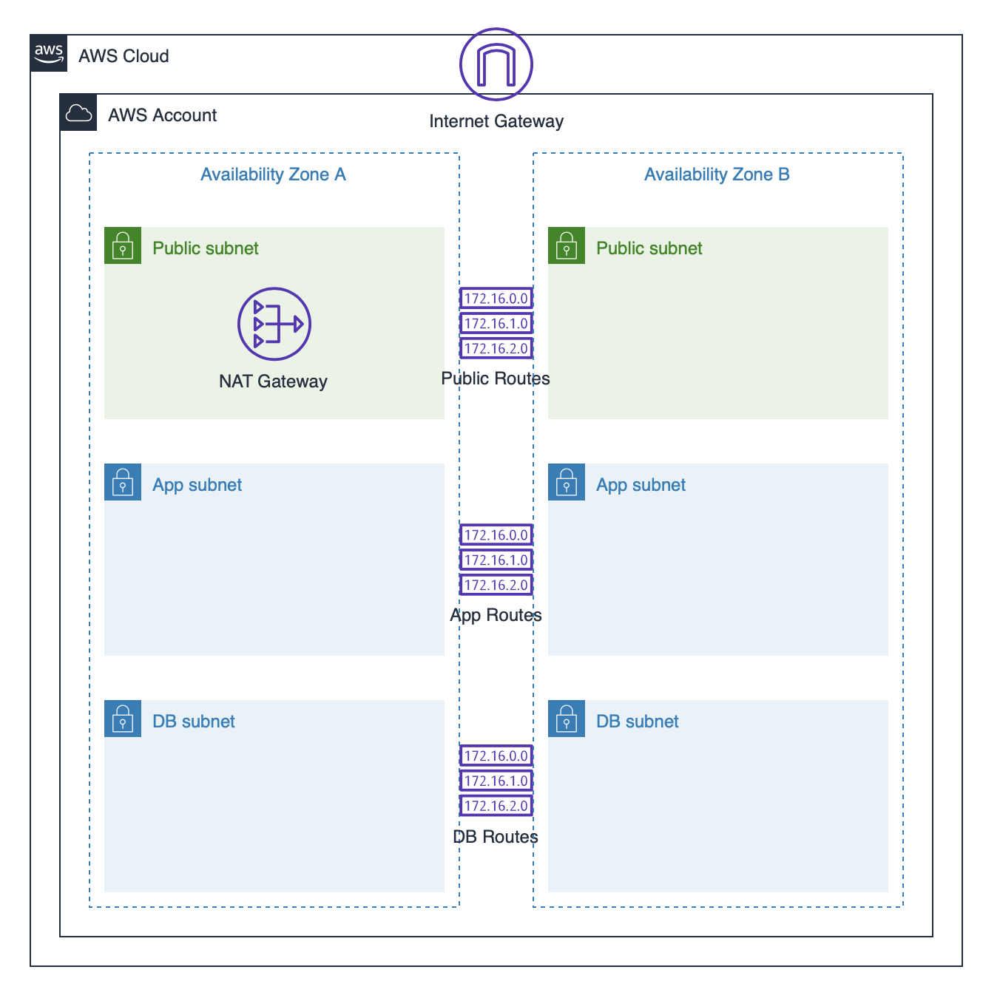

## Quick Start
An example Cloudformation template which deploys a reusable VPC stack providing standard VPC resources in ~3 minutes!  The VPC subnet layout includes 3 tier application subnettings across 2 availability zones, Internet Gateway, public/app/db specific route tables, NAT gateway with public and private route automatically defined.



A /23 Cidr range is required to be passed in as a parameter. The cloudformation template has an 'AllowedPattern' specified to check the passed in Cidr range is the correct subnet size. Built-in intrinsic functions - !Select and !Cidr - divide the supplied Cidr range into 6 /26 subnets and assigns them to the 3 teir/2 AZ subnet layout.

This example is super easy way to get started building your web applicaiton on AWS in a consistant way!

### Deploy New Stack
```bash
aws cloudformation create-stack \
--stack-name vpc-stack \
--template-body file://aws-vpc-3tier.yml \
--parameters ParameterKey=vpccidr,ParameterValue='172.0.0.0/23'
```

### Update Stack
```bash
aws cloudformation update-stack \
--stack-name vpc-stack \
--template-body file://aws-vpc-3tier.yml \
--parameters ParameterKey=vpccidr,ParameterValue='172.0.0.0/23'
```

### Delete Stack
```bash
aws cloudformation delete-stack \
--stack-name vpc-stack
```

## Copyright Amazon.com, Inc. or its affiliates. All Rights Reserved.
## SPDX-License-Identifier: MIT-0

## Security

See [CONTRIBUTING](CONTRIBUTING.md#security-issue-notifications) for more information.

## License

This library is licensed under the MIT-0 License. See the LICENSE file.
